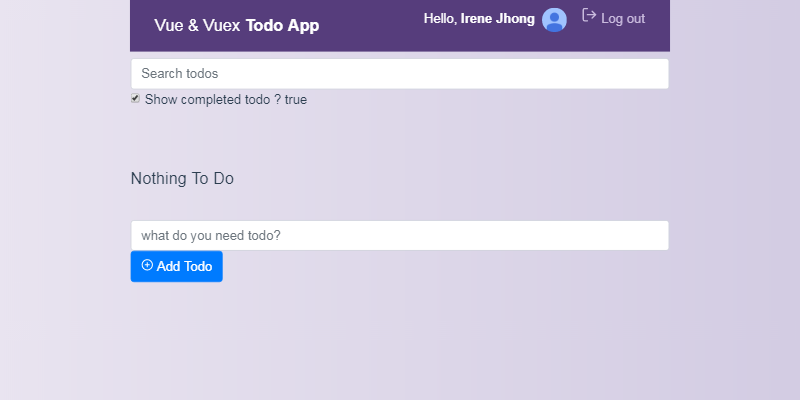

> A Vue.js project

# Vue Todo App

## Build Setup

``` bash
# install dependencies
npm install

# serve with hot reload at localhost:8080
npm run dev

# build for production with minification
npm run build
```

## 檢視
+ 登入畫面

+ 主畫面

+ 新增Todo項目

+ 隱藏完成的Todo項目（Show completed todo）

+ 關鍵字搜尋Todo項目


## Demo

